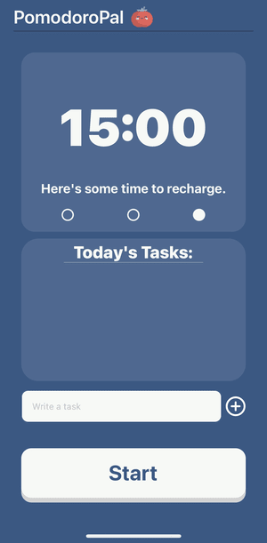

# PomodoroPal :tomato:
## TL;DR
PomodoroPal is a mobile Pomodoro timer app based on the Pomodoro Technique.

## About the Pomodoro Technique
The Pomodoro Technique was developed in the 1980s by Francesco Cirillo. It is a time management technique intended to help users stay focused and finish tasks faster. It works by alternating periods of work, which are typically 25 minutes in length, with short periods of rest, typically 5 minutes in length. One period of work followed by one period of rest is called an iteration. After 3 iterations, a longer break of about 15 to 30 minutes is provided. Of course, the lengths of each period can be adjusted according to each user's unique needs. For more information, check out [Wikipedia](https://en.wikipedia.org/wiki/Pomodoro_Technique "Pomodoro Technique").

## About PomodoroPal
PomodoroPal is a simple app I made while learning TypeScript and React Native. It was *_HEAVILY_* inspired by [pomofocus.io](https://pomofocus.io/), so if you're looking for an actual Pomodoro timer to use, go check them out. It is not intended to be too serious of an app, and you probably won't see it on the App Store anytime soon, but building it was a great learning experience - and I had a lot of fun, too. 

## What can PomodoroPal do? 
Honestly, 
1. Run a timer.
2. Keep track of a few tasks.

and that's basically it. So, fire it up, write down a few action items, and get to work.

## Atributions
As I've said, this app is basically a clone of [pomofocus.io](https://pomofocus.io/). I thought their graphic design looked great and, being a terrible graphic designer myself, I followed their good example. (Pomofocus.io lawyers please do not sue me). 

Also, the tomato icon was taken from the free icons section of [flaticon.com](https://www.flaticon.com/free-icon/tomato_877712). It's probably also copyrighted in some way, so all credit goes to the owner. (Please don't sue me). 

## What's next? 
I need to clean up a few of the inefficiencies in the app. I also plan to add a settings panel so users can set their own session times. 

## Gallery 
Here are some screenshots of the app:

